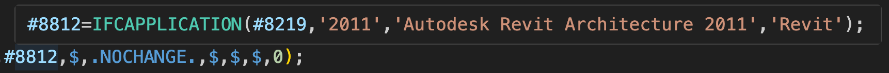
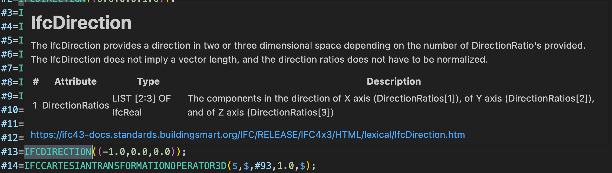
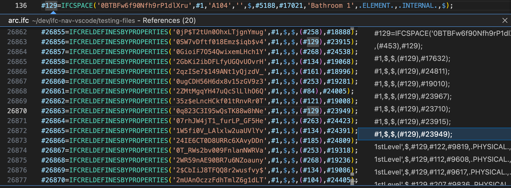
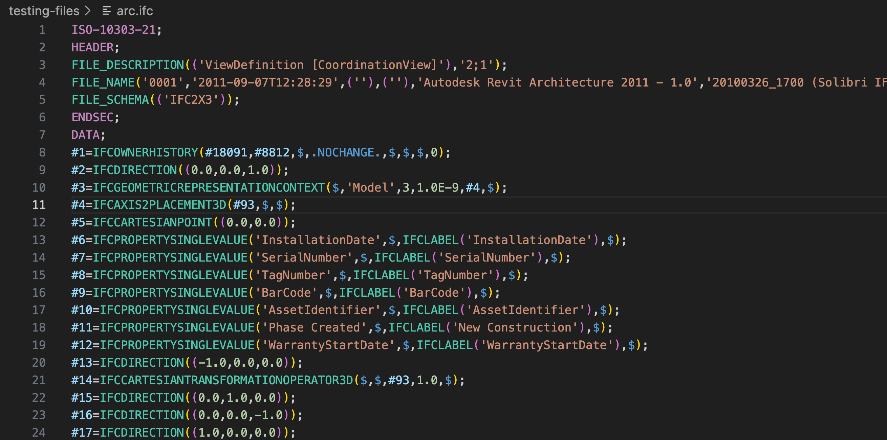

# IFC VS Code Extension

[](https://marketplace.visualstudio.com/)
[](LICENSE)

This extension adds language support for IFC STEP files (`.ifc`, `.step`, `.stp`) in Visual Studio Code and is powered by the [IFC Language Server](https://github.com/NepomukWolf/IFC-Language-Server).

For normal use, install the extension and open an IFC file. The extension automatically installs the language server version pinned by the current extension release.

It combines local editor support with the IFC Language Server to provide:

- Syntax highlighting
- Bracket matching and colored bracket pairs
- Hover information
- Go to definition
- Find references

## Features

### Hover Preview for Step IDs

Hover over STEP identifiers such as `#12345` to preview their definitions.



### IFC Entity Documentation on Hover

Hover over IFC entity names such as `IFCWALL` to view schema documentation.



### Go to Definition

Use `F12` or Ctrl/Cmd-click on STEP identifiers such as `#12345` to jump directly to their definitions.

### Find All References

Use `Shift + F12` to locate all references to an entity.



### Syntax Highlighting

Clean syntax highlighting for IFC STEP files.



## Installation

Install the extension from the Visual Studio Code Marketplace or from a `.vsix`.
No manual language-server setup is required for normal use.

## Usage

1. Open an IFC file (`.ifc`, `.step`, or `.stp`) in Visual Studio Code.
2. Hover over STEP IDs such as `#12345` or IFC entity names such as `IFCWALL`.
3. Use `F12` or Ctrl/Cmd-click for go to definition.
4. Use `Shift + F12` for find references.

## Settings

Most users do not need to change anything. Advanced settings are available for development and troubleshooting:

- `ifc.server.path`: Absolute path to a custom IFC language server binary.
- `ifc.server.args`: Extra command-line arguments passed to the server.
- `ifc.server.versionOverride`: Advanced override for the Git tag to download instead of the extension-pinned version.
- `ifc.server.githubRepository`: GitHub repository used for IFC language server downloads, in `owner/repo` form.
- `ifc.server.downloadAssetPattern`: Optional substring used to narrow the selected release asset.
- `ifc.trace.server`: Trace level for the VS Code language client.

## Commands

- `IFC: Download Language Server`
- `IFC: Restart Language Server`
- `IFC: Show Resolved Language Server`

## Editor Configuration

For IFC files, the extension enables these defaults:

- `editor.colorDecorators`: disabled
- `editor.matchBrackets`: always
- `editor.bracketPairColorization.enabled`: enabled

You can override these in your own VS Code settings if desired.

## Development

### Running the Extension

```bash
npm install
npm run compile
```

Then press `F5` in Visual Studio Code to launch an Extension Development Host.

### Using a Local Language Server Build

If you are developing the language server itself, point the extension at a local build with:

```json
{
  "ifc.server.path": "/absolute/path/to/ifc-language-server"
}
```

The easiest place to set this while testing is the Extension Development Host's settings JSON.

## Language Server

This extension is powered by the [IFC Language Server](https://github.com/NepomukWolf/IFC-Language-Server).

For normal use, the extension automatically installs the language server version pinned by the current extension release.

For release packaging, the extension expects platform-specific GitHub release assets whose names include operating-system and architecture hints such as `macos-arm64`, `linux-x64`, or `windows-x64`. Supported asset formats are raw executables, `.zip`, `.tar.gz`, and `.tgz`. Archives should contain either `ifc-language-server` or `ifc-lsp`, with `.exe` on Windows.

## License

This project is licensed under the **MIT License**. See [LICENSE](LICENSE) for details.
